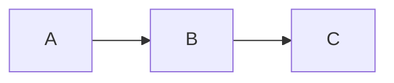

# Mermaid Flowchart Manual

This manual covers the mermaid embed type in EmbedM — a shorthand for creating simple flowcharts without writing Mermaid syntax directly.

## Table of Contents

```yaml embedm
type: toc
```

## Overview

The `mermaid` embed type lets you describe a linear flowchart as a simple arrow-delimited string. EmbedM converts it into a proper Mermaid code block. This is convenient for quick pipeline or process diagrams where writing raw Mermaid syntax would be overkill.

> [!NOTE]
> This plugin generates **linear flowcharts only** — a single chain of nodes connected in sequence. For branching, subgraphs, or other diagram types, write Mermaid syntax directly in a standard ` ```mermaid ` code block.

## Basic Usage

Describe your nodes separated by commas, ascii-arrows (`->`) or unicode arrows (`→`):

**Input:**
```yaml
type: mermaid
input: Markdown -> Parser -> Resolver -> Output
```

**Output:**

```yaml embedm
type: mermaid
input: Markdown -> Parser -> Resolver -> Output
```

Each item between arrows becomes a node. Nodes are connected in order with Mermaid's `-->` syntax.

## Delimiters

Three delimiter styles are supported — use whichever fits your keyboard or preference:

| Delimiter | Example |
|-----------|---------|
| `→` (unicode arrow) | `A → B → C` |
| `->` (ASCII arrow) | `A -> B -> C` |
| `,` (comma) | `A, B, C` |

You can even mix them in a single input, though sticking to one style is recommended for readability.

## Chart Direction

By default, charts flow left to right. Use the `chart` property to change direction:

**Input:**
```yaml
type: mermaid
input: Request → Validate → Process → Respond
chart: flowchart TB
```

**Output:**

```yaml embedm
type: mermaid
input: Request → Validate → Process → Respond
chart: flowchart TB
```

### Supported Directions

| Direction | Meaning |
|-----------|---------|
| `LR` | Left to Right (default) |
| `RL` | Right to Left |
| `TB` | Top to Bottom |
| `BT` | Bottom to Top |
| `TD` | Top-Down (same as TB) |

Both `flowchart` and `graph` keywords are supported (e.g., `graph LR`).

## Adding a Title

Use `title` to display a bold heading above the diagram:

**Input:**
```yaml
type: mermaid
input: Source → EmbedM → Documentation
title: Build Pipeline
```

**Output:**

```yaml embedm
type: mermaid
input: Source → EmbedM → Documentation
title: Build Pipeline
```

## What Gets Generated

The plugin generates a standard Mermaid code block. For example, `A → B → C` produces:

````

````

Nodes are assigned internal IDs (`n_1`, `n_2`, ...) with your labels in quotes. This means node names can contain special characters like apostrophes and parentheses.

## Complete Property Reference

```yaml
type: mermaid

# Required
input: A → B → C               # Arrow-delimited node labels
                                 # Delimiters: → (unicode), -> (ASCII), , (comma)

# Optional
chart: flowchart LR              # Chart type and direction (default: flowchart LR)
                                 # Types: flowchart, graph
                                 # Directions: LR, RL, TB, BT, TD
title: "My Diagram"             # Bold title displayed above the diagram
```
