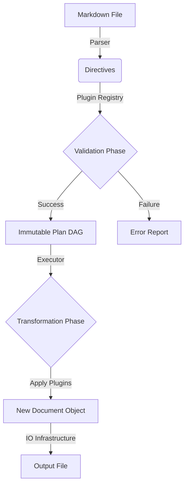

# EmbedM Architecture

## 1. Purpose

EmbedM is a deterministic Markdown compiler that:

* Parses Markdown documents
* Detects embed directives
* Resolves external sources (files, symbols, ranges, etc.)
* Rewrites the document with embedded content

It must remain:

* Deterministic
* Configurable
* Extensible
* Safe to use and stick to the limits and boundraries specified by the user 
* Testable
* Free of hidden side effects

Constraints & Limitations:

* Input/embedded files can only be files. Embedm does not allow other sourcing eg downloading or connecting to a database. If these are required it's up to the user to provide them as local files.

* The input / output is expected to be pure Markdown. While it's possible to add html styling, it's discouraged to do this via Embedm. There are other tools for this.

* While Embedm provides the means to limit resource use and file access, it's ultimately up to the user to control these boundries. 

* The system assumes that input files do not change between planning and execution. If they do, behavior is undefined. Future versions may introduce integrity validation if needed.

## 2. High Level Design 

### 2.1 Workflow

High level Concepts:

* `Source`: a Markdown file with 0 or more `embedm` blocks.
* `Content`: a source broken up in text and embedm blocks.
* `Limits`: a list of constraints that in general cannot be crossed, eg memory size or file locations
* `Transform`: an stateless operation taking in Directive (embedm block), loaded content, limits and producing output. 
* `Plugin`: a standard code executing a transformation on a `Embedm block`. It contains properties like metadata,configuration schema,  one transformer, validation rules. Plugins may participate in both planning (dependency analysis and validation) and execution (content transformation), but must not perform IO directly.
* `Plugin Registry`: a registry of all available plugins.
* `Plan`: a DAG of content outlining `content` use, dependencies and violations of the `limits`.
* `Directive`: is a parsed instruction in Markdown that describes: Type, Source, Options, Raw representation.
* `Plan Execution`: performs actions using the registered `plugins` on a plan.
* `Document`: the result of the plan execution.
* `Context`: Contains the systems used in the application (configuration, registries, file cache) and generated artifacts (plan, document). Context does not contain domain logic or behavior.

For a more detailed breakdown seen functional analysis.md

The workflow consists of the following steps:

**Phase 1 - Plan construction** 

1. Parse arguments / configuration, setting up limits and a context.
2. Read root file
3. Discover and register plugins based on the given configuration.
4. Build a plan dag by recursively collecting and scanning sources declared in plugins with a 'source' property, flagging limits or constraint violations as needed.
5. Consult/inform the user with the plan, specifically any violations of the constraints, allowing the user to cancel or proceed. In some cases execution may stop without asking the user for permission eg when a security violation is detected

The outcome of this phase is an immutable `plan`.

* Plan is immutable after construction.
* Approval does not mutate plan.
* Execution must not modify plan.
* Any derived artifacts must produce new objects.

**Phase 2 - Plan execution**
6. Based on the declared plugins, go through them one by one, applying their transform on their respective directives and generating a document.
7. Write the document to output if the plugin execution did not yield any errors.

Note that the document is an immutable object, each application of a plugin generates a new document object. In the [functional-analysis.md] we go into the details of this structure.

Conceptually the flow looks like this

Note that we accept directories as input. This flow then applies to every markdown file found in the directory.

### 2.2 Design Goals

We want to separate responsibility in clear components and layers, layers can only depend on other layers in one direction. Circular dependencies between should **not** happen.

Cross-layer imports are restricted and enforced via `import-linter`.

Any change that modifies layer boundaries must require explicit review of ARCHITECTURE.md.

**Embedm.Core Module**

| Layer          | Responsibility                                 |
| -------------- | -----------------------------------------------|
| cli            | Argument parsing, config                       |
| application    | Orchestration, application flow                |
| plugins        | Transform and plugin framework implementation  |
| parsing        | Extract domain models from Markdown            |
| domain         | Domain entities, domain rules, plan generation |
| infrastructure | IO implementations                             |

**Embedm.Plugin Module**

This module contains implementations of transformers and plugins

| Layer          | Responsibility                                 |
| -------------- | -----------------------------------------------|
| transformer    | transformer implementations                    |
| plugins        | plugins implementations                        |

Plugins have full access to transformers but not the other way around

### 2.2 No Hardcoded Domain Rules

The following are forbidden inside transformers:

* Hardcoded file extensions
* Hardcoded language mappings
* Hardcoded magic markers
* All defaults must be defined in configuration objects or explicit constants.

All behavior must be:

* Parameterized
* Config-driven
* Explicit

### 2.3 No Implicit Behavior

Forbidden:

* Hidden global config
* Singleton registries
* Side-effect-based mutation
* Runtime type switching via string checks

Allowed:

* Explicit registries
* Dependency injection via constructor
* Immutable configuration objects

### 2.4 Invariants

* Domain layer contains no IO.

* Plan creation performs no file writes.

* All filesystem access occurs in infrastructure.

* All transformations are deterministic.

* No global mutable state.

* All configuration is explicit and typed.

* No circular imports.

### 2.5 Error handling

Error handling related to user input (eg missing files, unknown options) must be captured and presented to the user. Programming errors should be raised as exceptions and will result in a fail fast scenario where execution is stopped.

**Planning Phase**

Depending on their severity the user may choose to:

* ignore them 
* cancel the process 

There are three levels of errors

* Warnings: eg unknown options in directives, which will be ignored in the output
* Errors: eg missing files, if the user ignores these, the errors will be captured in the output (eg note: missing file). 
* Fatals: eg path constraint violations, limit violations. These will be captured during planning. The user cannot continue execution.

**Execution Phase**

At this point warnings should not occur, however the following could happen

* Errors: Eg  Execution of a plugin failed, this should not bring the system down, other plugins should continue but will be noted in the output
* Fatal: Eg a constraint violation occured even though the planning didn't capture it. The system will stop.

## 3. Core Concepts

See functional-analysis.md

## 4. Dependency Rules

Enforced via `import-linter`.

Allowed:

* application → domain
* application → parsing
* application → infrastructure
* cli → application
* infrastructure → domain (interfaces only)

Forbidden:

* domain → infrastructure
* domain → cli
* parsing → infrastructure
* circular dependencies anywhere

## 5. Configuration Rules

Configuration:

* Is loaded in infrastructure
* Passed explicitly into application
* Passed explicitly into domain as immutable objects

No module-level config variables.

No implicit reads from environment.

## 6. Testing Philosophy

### 6.1 Coverage is Not a Goal

Coverage is informational, not authoritative. Tests must assert behavior, not implementation details.

### 6.2 Mutation Resistance

Tests must fail if:

* Conditions are weakened
* Edge cases are removed
* Core logic is simplified incorrectly

Mutation testing is required before release.

### 6.3 Layer-Based Testing

* Domain → pure unit tests (no mocks)
* Parsing → input/output tests
* Application → integration tests
* Infrastructure → minimal tests

## 7. Complexity Limits

Enforced via `xenon`.

* No function > B complexity
* No module > A average complexity
* No god objects

Refactor when limits are exceeded.

## 8. Extension Model

Adding new embed type must require:

1. New transformer class
2. Registration in registry
3. Tests

It must NOT require:

* Editing existing transformers
* Editing parsing logic
* Editing application flow

If it does, architecture has degraded.

## 9. Anti-Patterns

The following indicate architectural decay:

* Growing `if directive.type == ...` chains
* Increasing cross-module imports
* Transformers reading files directly
* Hidden configuration access
* Tests that only assert happy paths
* Snapshot tests without semantic assertions

## 10. Iterative implementation

* We will implement features one by one, creating an MVP at any stage
* The features listed are generally high level, before starting on a feature we will need
  to review the feature to see if it needs to be broken up into smaller chunks (subtasks)
* For each feature we will create a branch
* After implementation of a feature we will run all required tools (ruff, vulture, radon...)
* After the required tools pass a full review will take place
* Once the review passes we will commit the implementation and move on to the next feature

## 11. Coding best practises

* Variables: Use descriptive names (e.g., user_email, not ue).

* Boolean: Use the is_value or has_value format

* Functions: Use verb-noun (e.g., calculate_total()). 

* Avoid side effects, aim for a functional coding style where that makes sense.

* Classes: Use nouns and roles (e.g., UserService).

* Avoid using nested functions unless
  * The helper is tiny (≤ 10 lines)
  * It is purely functional
  * It does not mutate outer scope
  * It is tightly coupled to one algorithm
  * It improves readability
  * It is not reused elsewhere

* Standard abbrevations include i,j,k for iteration, min, max, idx for index. Avoid nonstandard abbreviations. 

* Write self-explanatory code using types and structure, not excess comments.

* For code comments, stick to input (parameters), expected output descriptions and error notications. Do not write usage/extensions in the comments, leave that to specific external docs.

* Generate docs with Sphinx or MkDocs. 

* Use consistent docstrings (Google/Numpy format).

* Use Enum for fixed value sets.

* Use constants for shared fixed values and define constants in UPPERCASE.

* Use config objects (dataclasses) over raw dicts.

* Use linters to detect common issues (e.g., hardcoded secrets)

## 12. AI Directives

When using AI to generate code:

* AI must follow this document.
* If it violates a constraint, it must explain why.
* AI may not introduce new layers without justification.
* AI must not bypass registry pattern.
* AI must not introduce global state.
