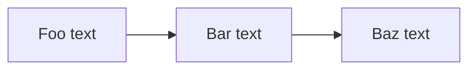

# Extending Embedm with a custom plugin

As soon as you install embedm via `pip embedm`, you can start compiling markdown files. Embedm comes with several standard plugins, file embedding, table embedding, creating a table of contents and so on. However if you have a need for a compilation step that none  of these plugins solves, you can easily add your own. In this example we show how to create a plugin step by step.

## Basic setup

For this example we assume [`python`](https://www.python.org/downloads/) and [`uv`](https://docs.astral.sh/uv/getting-started/installation/) are installed. Let's create the following setup:

1) Create a test directory: 

```bash
    md embedm_test` (nix/mac)
    mkdir embedm_test` (win)
```

2) Enter said directory
```bash
    cd embedm_test
```

3) Create a virtual environment using uv
```bash
    uv venv
```

4) Activate the virtual env

```bash
   source .venv/bin/activate (nix/mac)
   .venv\Scripts\activate (win)
```

5) Install embedm

```bash    
    uv pip install embedm
```

6) Create a simple md file in this directory, eg:

````md
# Embedm Test

```yaml embedm
type: toc
```

## Chapter 1: Hello world

Embedm is running

## Chapter 2: On building plugins

Here we will add our new plugin
````

7) verify if embedm works, run: 

```bash
embedm .\test.md
```

you should see the following on the output:

```shell
embedm vx.y.z
# Embedm Test

  - Chapter 1: Hello world
  - Chapter 2: On building plugins

## Chapter 1: Hello world

Embedm is running

## Chapter 2: On building plugins

Here we will add our new plugin
embedm process complete, 1 file written to stdout, 1 ok, 0 warnings, 0 errors, completed in 0.041s
```

## Creating a trivial Plugin

Now we have the setup in place, let's start developing a plugin. We will make a plugin to make the markdown-`mermaid` extension suitable for people who tend to forget how the `mermaid` syntax works and just want a quick flow diagram look pretty. 

First let's define a minimal python project:

```toml
[project]
name = "plugin_test"
version = "0.1.0"
dependencies = [
    "embedm"
]

[build-system]
requires = ["setuptools"]
build-backend = "setuptools.build_meta"
```

Next let's generate a embedm configuration file. We'll need that (and the pyproject) to declare the plugin we will be writing:

```bash
embedm --init
```

After this an `embedm-config.yaml` should have appeared. We'll leave that for the moment.

Now it's time to create the `python` script that will define the plugin. Open your favorite editor and create a new file called `mermaid_plugin.py`.

```py
from embedm.plugins.api import PluginBase

class MermaidPlugin(PluginBase):
    name = "simple mermaid"
    api_version = 1
    directive_type = "mermaid"

    def transform(self, plan_node, parent_document, context=None):
        return "mermaid output"
```

Now we need to let `embedm` know where to find this plugin. We need to do two things:

- **Register an entry point** in `pyproject.toml` — this is a Python packaging mechanism that makes the plugin *discoverable*. Without it embedm cannot find your class at all, regardless of any other configuration.
- **Add the module to `plugin_sequence`** in `embedm-config.yaml` — this controls *load order*, i.e. which plugins embedm will actually load and in what sequence. A plugin that is not in `plugin_sequence` will be discovered but skipped.

You can verify both steps at any time with `embedm -p`, which prints every loaded plugin, any skipped ones, and any diagnostics such as unresolved `plugin_sequence` entries.

To add an entry point, add the following to your `pyproject.toml`:

```toml
[project.entry-points."embedm.plugins"]
mermaid_plugin = "mermaid_plugin:MermaidPlugin"
```

To set the plugin sequence, update the plugin sequence in the `embedm-config.yaml` to include `mermaid_plugin`:

```yaml
# plugin load order
plugin_sequence:
  - embedm_plugins.file_plugin
  - embedm_plugins.query_path_plugin
  - embedm_plugins.table_plugin
  # put your plugin below the table_plugin
  - embedm_plugins.hello_world_plugin
  - mermaid_plugin
  # but above the synopsis_plugin
  - embedm_plugins.synopsis_plugin
  - embedm_plugins.recall_plugin
  - embedm_plugins.toc_plugin
```

Once that's in place, we'll need to install this 'package' so python actually can find it.

> **Environment note:** The plugin must be installed into the same Python environment that runs `embedm`. A common silent failure is installing into a different environment — the plugin appears registered but is never loaded. Make sure your project virtual environment is active before running the install command below.

```bash
uv pip install -e .
```

If your virtual environment is not active, or you need to target it explicitly, pass the Python interpreter path:

```bash
uv pip install -e . --python .venv/Scripts/python.exe   # Windows
uv pip install -e . --python .venv/bin/python           # macOS / Linux
```

With the scaffolding in place we can update the `test.md` file to embed this mermaid plugin:

````md
...
## Chapter 2: On building plugins

```yaml embedm
type: mermaid
```
````

Now run embedm again (`embedm test.md`), and you should see:

```shell

# Embedm Test

  - Chapter 1: Hello world
  - Chapter 2: On building plugins

## Chapter 1: Hello world

Embedm is running

## Chapter 2: On building plugins

mermaid output

embedm process complete, 1 file written to stdout, 1 ok, 0 warnings, 0 errors, completed in 0.034s
```

## Improving the plugin

Now this works, we can add some actual functionality. Let's add a property to the `embedm directive` to take some mermaid input. The first thing we need to do is to 'validate' the key is in the directive. Update your mermaid.py with a `validate_directive` method. 

```py
from embedm.plugins.api import Directive, PluginBase, PluginConfiguration, Status, StatusLevel

INPUT_KEY = "input"

class MermaidPlugin(PluginBase):
    name = "mermaid"
    api_version = 1
    directive_type = "mermaid"

    def validate_directive(
        self, 
        directive: Directive, 
        _configuration: PluginConfiguration | None = None
    ) -> list[Status]:
        
        input_str = directive.options.get(INPUT_KEY)
        
        if input_str is None:
            return [Status(StatusLevel.ERROR,'Mermaid plugin is missing  Directive option "Input"')]

        return []

    def transform(self, plan_node, parent_document, context=None):
        return "mermaid output"
```

If we re-run `embedm`, you will find that it's expressing some disapproval of our current `test.md`.

```shell
embedm vx.y.z
error: Mermaid plugin is missing  Directive option "Input"
Continue with compilation (yes/no/always/exit)? [y/N/a/x]
```

Press 'n' (no), and let's update the `test.md` file:

````markdown
# Embedm Test

```yaml embedm
type: toc
```

## Chapter 1: Hello world

Embedm is running

## Chapter 2: On building plugins

```yaml embedm
type: mermaid
input: Foo text -> Bar text -> Baz text
```
````

If you run it, the error will be gone, and the old output should have appeared.

Now let's update the plugin's transformer to do something meaningful

```py
import re

from embedm.plugins.api import Directive, PlanNode, PluginBase, PluginConfiguration, Status, StatusLevel

INPUT_KEY = "input"

DELIMITER_PATTERN = re.compile(r'\s*(?:→|->|,)\s*')

class MermaidPlugin(PluginBase):
    
    # ... the previous code such as validate_directive goes here

    def transform(self, plan_node: PlanNode, parent_document, context=None):
        chart ='flowchart LR'
        input_text = plan_node.directive.options.get(INPUT_KEY)

        # Split input into node labels
        nodes = DELIMITER_PATTERN.split(str(input_text))
        nodes = [n.strip() for n in nodes if n.strip()]

        if len(nodes) < 2:
            return self.format_error(
                "Mermaid Error",
                "At least 2 nodes are required. Separate nodes with →, ->, or comma."
            )

        # Build mermaid diagram
        lines = [chart]

        # Node definitions
        for i, label in enumerate(nodes, 1):
            lines.append(f'  n_{i}["{label}"]')

        # Connections
        for i in range(len(nodes) - 1):
            lines.append(f'  n_{i + 1} --> n_{i + 2}')

        content = '\n'.join(lines)
        result = f'```mermaid\n{content}\n```'

        # Wrap with title if provided
        title = 'Mermaid chart'
        if title:
            result = f'**{title}**\n\n{result}'

        return result
```

If you run `embedm` now, with the following extra args:

```bash
embedm test.md -o .\test.compiled.md
``` 

And open the `test.compiled.md` you should see:

````markdown
# Embedm Test

  - Chapter 1: Hello world
  - Chapter 2: On building plugins

## Chapter 1: Hello world

Embedm is running

## Chapter 2: On building plugins

Here we will add our new plugin


**Mermaid chart**


````

If your editor of choice has a mermaid preview functionality, you should see:


## Next steps

In this tutorial we've shown how to create a embedm plugin from scratch. Do note we've taken some short-cuts. The `transform` method actually does more than it should do. Eg a `transform` should only perform the magic of transforming its input in a `markdown` string. It should NOT do error checking, as we did here:

```py
        if len(nodes) < 2:
            return self.format_error(
                "Mermaid Error",
                "At least 2 nodes are required. Separate nodes with →, ->, or comma."
            )
```
 
Error checking is up to the `validate_directive` and `normalize_input` methods. 

We will address the 'proper' way of developing plugins in a future episode. For now please refer to [architecture](../../architecture.md) and the [plugin implementations](https://github.com/Fultslop/embedm/tree/main/src/embedm_plugins) in embedm for more information.